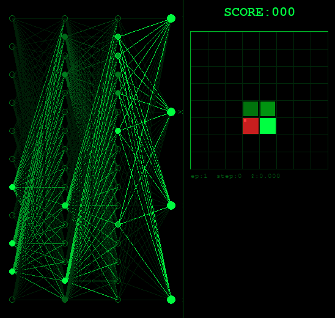
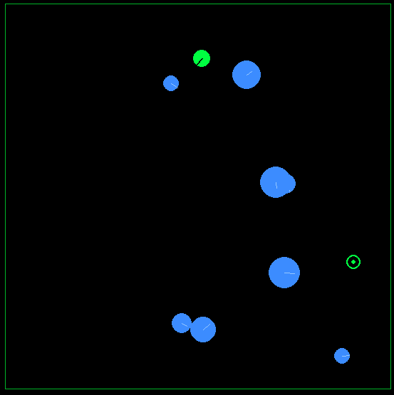
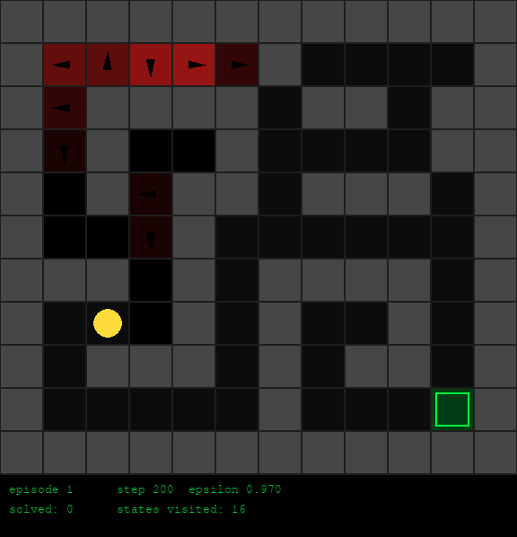

# ReLAB

> Gymnasium-based environment for RL research/experiments. In machine learning and optimal control, reinforcement learning (RL) is concerned with how an intelligent agent should take actions in a dynamic environment in order to maximize a reward signal. Reinforcement learning is one of the three basic machine learning paradigms, alongside supervised learning and unsupervised learning.

<table>
  <tr>
    <td align="center"></td>
    <td align="center"></td>
  </tr>
  <tr>
    <td align="center"><b>Snake</b></td>
    <td align="center"><b>Robot navigation</b></td>
  </tr>
  <tr>
    <td align="center"></td>
    <td align="center"></td>
  </tr>
  <tr>
    <td align="center"><b>Gridworld</b></td>
    <td align="center"></td>
  </tr>
</table>
